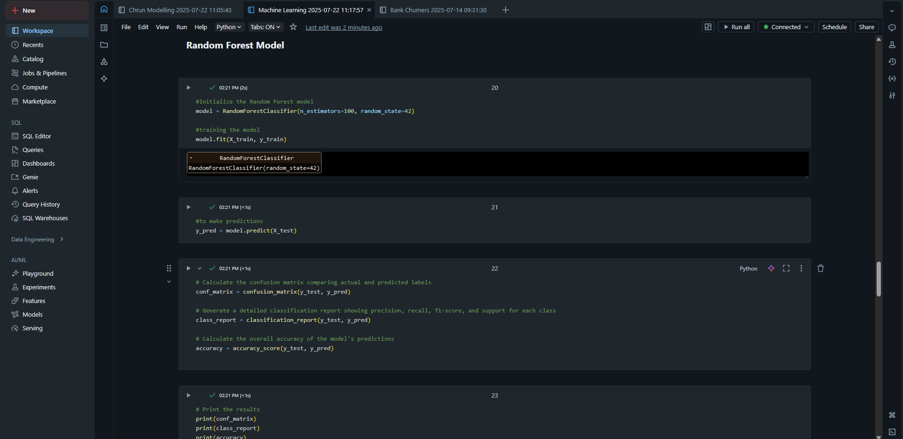

# Churn Prediction Model 
by Zoleka Magagula

## Objective
The objective of this project was to develop a predictive classification model capable of accurately identifying target outcomes based on historical data. This involved preprocessing the dataset, training multiple machine learning models, and evaluating their performance to determine the most effective approach for solving the classification problem

## Steps taken
**1. Explore and analyze the dataset:**
Identify patterns, class imbalances, and any potential data quality issues.

**2. Prepare the data for modeling:**
Perform data cleaning, select relevant features, and split the dataset into training and testing sets.

**3. Train classification models:**
Implement and train algorithms such as Logistic Regression and Support Vector Machine (SVM).

**4. Evaluate model performance:**
Use metrics including accuracy, precision, recall, F1-score, and the confusion matrix to assess and compare the models.

**5. Visualize results:**
Create visualizations such as heatmaps of confusion matrices and annotated classification reports to support interpretation.

**6. Select the best-performing model:**
Identify the model with the highest predictive performance and recommend it for deployment or further optimization

## A Snapshot of the code

